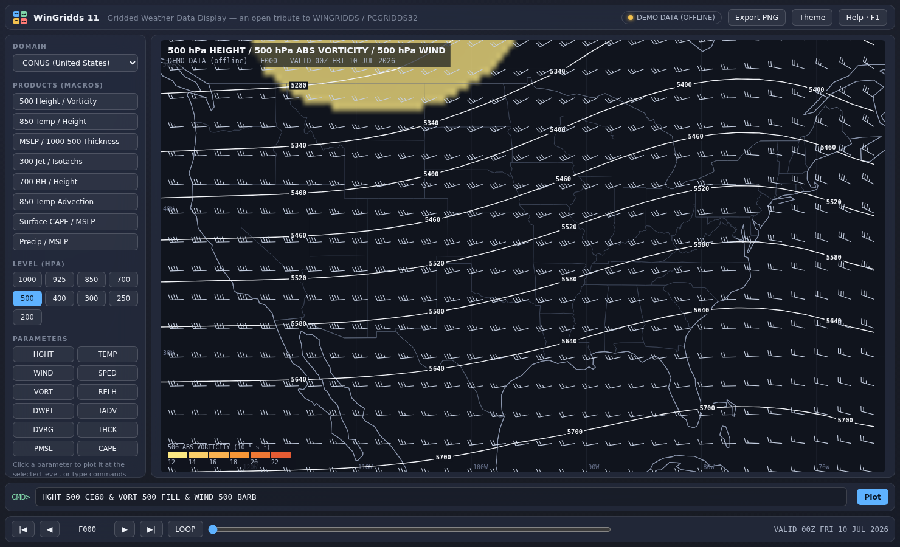

# WinGridds 11

A modern, Windows 11-friendly re-creation of **WINGRIDDS / PCGRIDDS32** — the classic
freeware gridded-weather-data display by Jeff Krob ([winweather.org](http://winweather.org/)).
The original 32-bit application has become difficult to run on Windows 11; this project
rebuilds its concept and command style as a zero-install web app that runs in any modern
browser.

> **Not affiliated** with the original author. This is an independent tribute that shares
> no code with the original program.

## Features

- **Classic command-line product building** — type `HGHT 500 CI60 & VORT 500 FILL & WIND 500 BARB`
  and press Enter, just like building a PCGRIDDS macro. Overlay any number of fields with `&`.
- **Live GFS model data** ingested from the free [Open-Meteo](https://open-meteo.com) API
  (no API key, no install), on a grid covering the selected domain out to **+168 h** in 6-h steps.
- **Diagnostics computed on the grid**, in the spirit of the original: absolute/relative
  vorticity, divergence, temperature advection, vorticity advection, 1000–500 hPa thickness,
  dewpoint, isotachs.
- **Contours with inline labels, color-filled fields with legends, wind barbs, H/L markers**,
  dashed sub-zero contours, emphasized 5400 m thickness line.
- **Animation** through all forecast hours (`LOOP`, or the transport controls / Space bar).
- 10 preset domains (CONUS, North America, Europe, Atlantic, Pacific, South Asia, East Asia,
  Australia, South America, Tropical Atlantic).
- Product **macro buttons** (500 Height/Vorticity, 850 Temp, MSLP/Thickness, 300 Jet, 700 RH,
  temperature advection, CAPE, precipitation).
- **PNG export** of the current chart.
- Windows 11 look: Mica-style translucent panels, Segoe UI, light/dark themes.
- **Offline demo mode** — if the network is unavailable the app switches to a physically
  plausible synthetic dataset (geostrophically balanced baroclinic wave train), so every
  command still works. Force it with `?demo=1`.

## Running on Windows 11

No installation required:

1. Download this repository (Code → Download ZIP) and extract it.
2. Double-click **`index.html`** — it opens in Edge/Chrome and immediately ingests live GFS data.

To make it feel like a native app, open it in Microsoft Edge and choose
**… menu → Apps → Install this site as an app**. You get a Start-menu entry, its own window,
and a taskbar icon.

(You can also serve the folder with any static file server, or host it on GitHub Pages.)

## Command reference

Press **F1** in the app for the full built-in reference. Quick summary:

| Command | Meaning |
|---|---|
| `HGHT 500` | 500 hPa geopotential height contours |
| `TEMP 850 FILL` | 850 hPa temperature, color-shaded |
| `WIND 300 BARB` | 300 hPa wind barbs |
| `SPED 300 FILL` | Isotachs (jet stream) |
| `VORT 500 FILL` | Absolute vorticity |
| `TADV 850 FILL` | Temperature advection |
| `PMSL CI4 HILO` | MSL pressure, 4 hPa interval, H/L markers |
| `THCK CI60 DASH` | 1000–500 hPa thickness, dashed |
| `CAPE FILL`, `PRCP FILL`, `RELH 700 FILL`, `DVRG`, `VADV`, `DWPT`, `T2M`, `D2M` | more fields |
| Modifiers | `CI<n>` interval · `FILL`/`LINE`/`BARB` · `DASH` · `HILO` · `CLR1–6` · `SMTH` |
| Global | `F048` jump to forecast hour · `LOOP` animate · `MAP` base map · `HELP` |

Keyboard: **←/→** step time · **Space** loop · **Home/End** first/last frame · **↑/↓** command
history · **F1** help.

## Files

- `index.html` — the entire application (UI, data ingest, diagnostics, renderer)
- `mapdata.js` — coastlines, country borders and state lines (Natural Earth 110m, public domain)

## Data & credits

- Model data: NCEP **GFS**, served by [Open-Meteo](https://open-meteo.com) (CC-BY 4.0 attribution).
  Open-Meteo abstracts the model cycle; forecast-hour labels are referenced to today's 00 UTC as
  presented by the API.
- Base map: [Natural Earth](https://www.naturalearthdata.com/) 1:110m (public domain).
- Original concept: **WINGRIDDS / PCGRIDDS32** by Jeff Krob, freeware at
  [winweather.org](http://winweather.org/) — used operationally by the NOAA/WPC International Desks.
